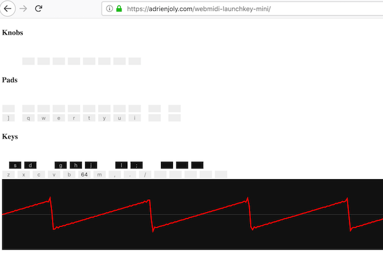

# WebMIDI Synth for Launchkey Mini

An experimental synthesizer made for the Novation Launchkey Mini MIDI keyboard, using Web Audio / WebMIDI.

It can also be controlled using any other MIDI controller, and with your computer's keyboard!

- Demo video: [youtube.com/watch?v=w-BsTGGIlwA](https://www.youtube.com/watch?v=w-BsTGGIlwA)
- Try it now: [adrienjoly.com/webmidi-launchkey-mini](https://adrienjoly.com/webmidi-launchkey-mini)

This is work in progress. Feedback and suggestions are welcome!

## Vision

This synthesizer was developed with the aim of performing "chiptune" music live. The idea would be to have 4 musicians use MIDI instruments to perform each of the 4 monophonic channels that a Nintendo/NES can play.

You can read more about that project, there: [adrienjoly.com/chips](https://adrienjoly.com/chips)

## Features

- Tone synthesizer with the following modes (use the `[` and `]` keys to cycle through them):
  - Square wave
  - Pulse wave with 12.5% and 25% duty cycle (like on the Nintendo NES and GameBoy)
  - Triangle wave
  - Sawtooth wave
  - Sine wave
- Noise generator with the following built-in sounds/presets:
  - bass drum kick (press `Q`)
  - snare drum (press `W`)
  - closed hi-hat (press `E`)
  - opened hi-hat / cymbal (press `R`)
- Supported inputs:
  - Novation Launchkey Mini keyboard, or any other MIDI controller.
  - your computer's QWERTY keyboard.
- Visualizations:
  - oscilloscope, for the tone synthesizer only

## Contributors

- [Adrien Joly](https://github.com/adrienjoly)
- [Jérôme Schneider](https://github.com/netgusto)
